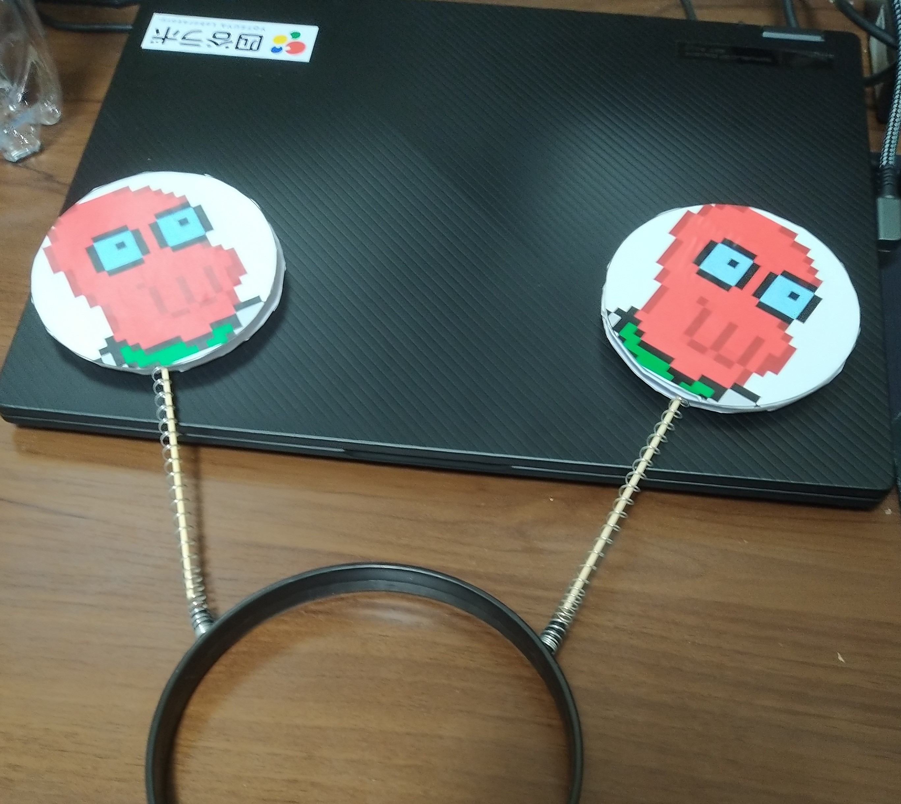
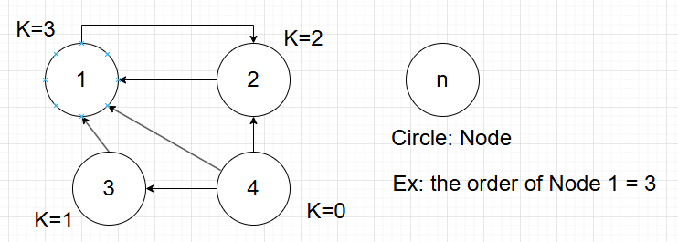
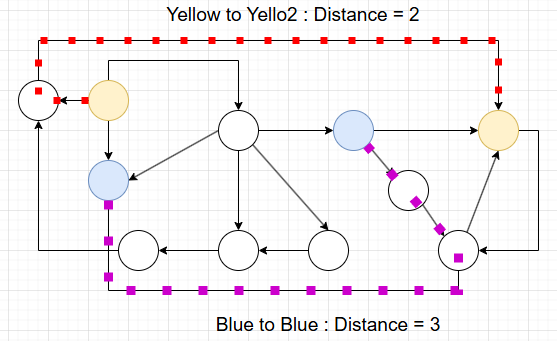
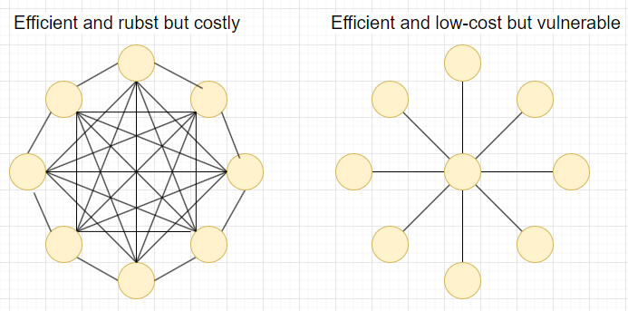
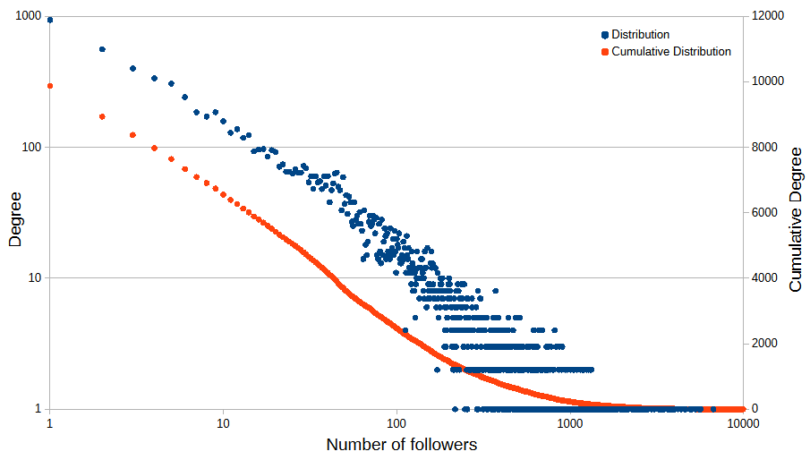
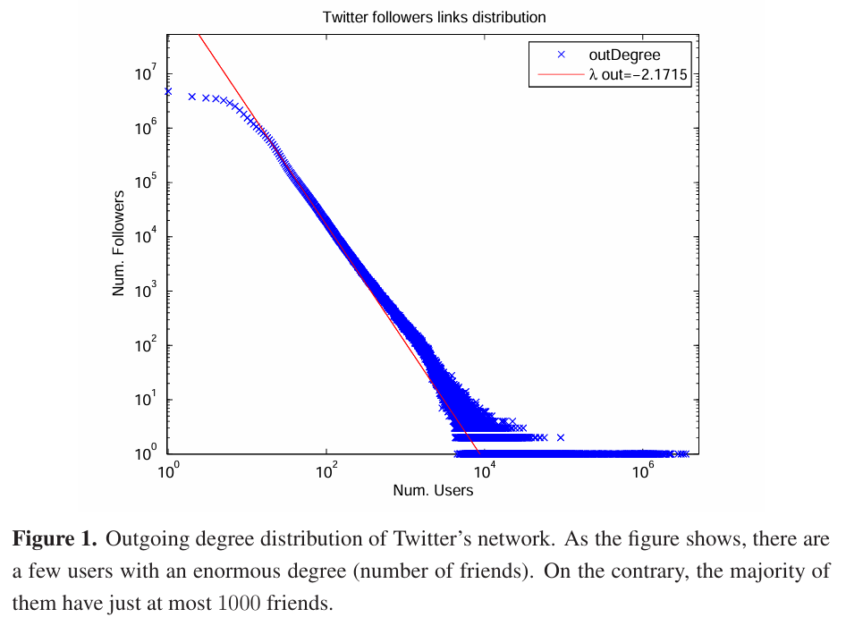
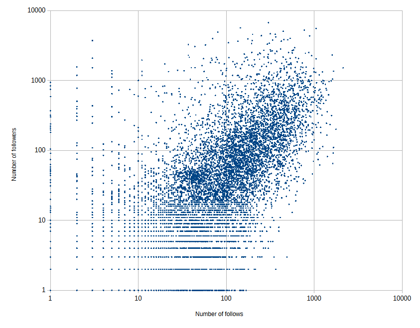
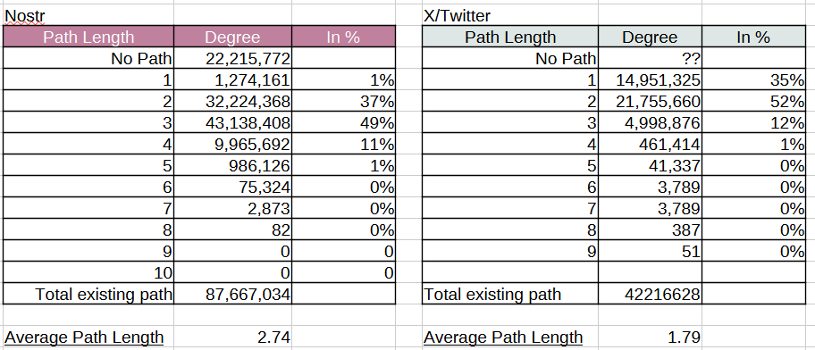
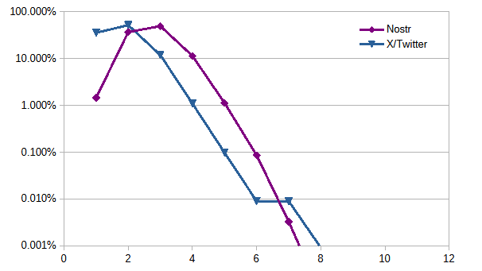

<!-- 
class: title
-->
# Does Nostr Scale...?
## Investigation of Nostr's follower network as "Complex Network"

---
<!-- 
class: slides
-->
# Self Introduction

- Working as an engineer but in a different field from software engineering 
- No background as software engineer
- Math-loving person

---
# Motivation - Is Nostr an efficient social network?

## What are the characteristics of "Efficient Networks"?

From a point of view of "Complex Network" ...

- **Scale Free Network**
- **Small World Property**
- Form Clusters

I am going to focus only on "Scale Free Network" and "Small World Property" today.

---
# What is "Complex Network"?

(From Wikipedia [https://en.wikipedia.org/wiki/Complex_network](https://en.wikipedia.org/wiki/Complex_network))

In the context of network theory, a complex network is a graph (network) with non-trivial topological features—features that do not occur in simple networks such as lattices or random graphs but often occur in networks representing real systems.

(end)

- Not random
- Not simple such as lattice
- Representing real systems

---
# Reference books and readings about "Complex Network"

- 「複雑ネットワーク」とは何か　複雑な関係を読み解く新しいアプローチ (増田直紀, 今野紀雄/講談社ブルーバックス)
- 複雑ネットワーク : 基礎から応用まで (増田 直紀, 今野 紀雄/近代科学社)
- [複雑ネットワークの統計的性質(北海道大学 工学研究科 応用物理学専攻
矢久保 考介)](https://www.topo.hokudai.ac.jp/education/SpecialLecture/090501.pdf)

---
# Wat is "Scale Free Network"?

The degree distribution of the **order of nodes** has a power-low.

$$P\left(k\right)=P_0 k^{-\gamma}$$

- $P\left(k\right)$: Probability(degree) distribution function of the order k
- $k$: The order nodes - The number of link on node
- $\gamma$: Power-law value

**A scale-free network has a long-tail degree distribution, meaning some of nodes(users) have a large number of connection(followers)**

---
# What is "Small World Property"?

The average **path length between nodes** are very small compared to the network size.

$$Average Path Length \propto \log (Network Size) $$

_Path length between nodes:_

---
# Is the real world small?

**The idea of "Six degrees of separation"**

(From wikipedia [https://en.wikipedia.org/wiki/Six_degrees_of_separation](https://en.wikipedia.org/wiki/Six_degrees_of_separation))

*Six degrees of separation is the idea that all people are six or fewer social connections away from each other. As a result, a chain of "friend of a friend" statements can be made to connect any two people in a maximum of six steps. It is also known as the six handshakes rule.*
(End)

In real world the distance between a human and a human in a social network can be surprisingly small even the two person are picked randomly.

---
# Why are the concepts important?

**"Scale-Free" and "Small World" properties can be good indicators about efficiency and robustness**

**A key to the scalable network is balance between "efficiency" and "robustness."**

---
# Investigation - Is Nostr "Scale-Free" and "Small World"?

Investigated the social graph of Nostr by...
- Collect kind-1 from Aug 1st to 31st, 2024 to identify active users' npub
- Collect kind-3 for all the collected npubs
- Identify all the followers between the active npubs
- Derived the degree distribution of numbers of followers
- Calculated the degree distribution of distances between npubs in "follower-network"

---
# Investigation - Is Nostr "Scale-Free"?

## Condition
- Active npubs from Aug 1st to 31st in 2024
- Relays
    nos.lol, relay.snort.social, nostr.fmt.wiz.biz,
    **nostr-pub.wellorder.net**, nostr.mom,	nostr.oxtr.dev,	
    nostr.semisol.dev, relay.damus.io,	relay.nostr.bg,	soloco.nl,
	nostr.bitcoiner.social", **nostr.einundzwanzig.space**
- The number of npubs:  67217 
- **The number of npubs with at least one follower: 9868**

---
# Investigation - Is Nostr "Scale-Free"?

$\gamma$ = 1.27 (For X/Twitter $\approx$ 2 to 3 in various surveys)
$\gamma$ is smaller in Nostr. Longer-tail distribution compared to X. Users are more equally followed.

---
# Investigation - Is Nostr "Scale-Free" 

Example Twitter shows "scale-free" property with $\gamma$ of 2.17
From: [https://www.mdpi.com/1099-4300/17/8/5848](https://www.mdpi.com/1099-4300/17/8/5848)

---
# Investigation - Is Nostr "Scale-Free"?

## Conlusion

- Follower network is "scale-free". $P(k)$ Log-log plot showed Power-law.
    $P\left(k\right) = P_0 k^{-\gamma}$ → $(\log P\left(k\right)) = \log P_0 -\gamma (\log k)$
- $\gamma \approx 1.27$, relatively smaller compared to X/Twitter (2 to 3)
- Suggesting...
  - Users are equally followed compared to X/Twitter
  - May not be efficient as X/Twitter network
  - The network might not be large enough??
  - The effect of relay has not been taken in account

---
# Appendix - Correlation between "follows" and "followers"

---
# Investigation - Is Nostr a"Small-World?"

## Condition
- Used the same npubs obtained from "Scale-free" study
    - npubs at least have one follower
- The follower network is represented as directed-unweighted graph
- Calculated the shortest paths between nodes for all the combination utilizing Dijkstra algorithm
- Library: gonum/graph
 
 ---
# Investigation - Is Nostr a"Small-World?"

## Result

- Average distance: 2.74
- Twitter is much smaller (1.79) 

From: [https://www.mdpi.com/1099-4300/17/8/5848](https://www.mdpi.com/1099-4300/17/8/5848)

---
# Investigation - Is Nostr a"Small-World?"

## Result

---
# Investigation - Is Nostr a "Small-World"?

## Conclusion
- Nosrt is small world
    - About 87% of all the combination have the distances equal or less than 3 
- X/Twitter is much smaller 

---
# Conclusion - Does Nostr Scale?

## Fact
- Nostr's follower network is scale-free
    - $gamma \approx 1.27$, which is smaller than X/Twitter
- Nostr is a "Small World"
    - Average path length: 2.74, larger than X/Twitter
- Twitter is more "scale-free" and "smaller" for the size of the network!

---
# Conclusion - Does Nostr Scale?

## Thoughts
- Nostr likely can scale to a larger network as a social media because Nostr shows both "Scale Free" and "Small World" properties
- However, X/Twitter is probably more efficient 
- Why Nostr is less efficient than X/Twitter?
    - Users tend to follow each other more often than X/Twitter
    - Relays may separate a group from other groups
    - May need to follow a large number of relays to be a hub user
